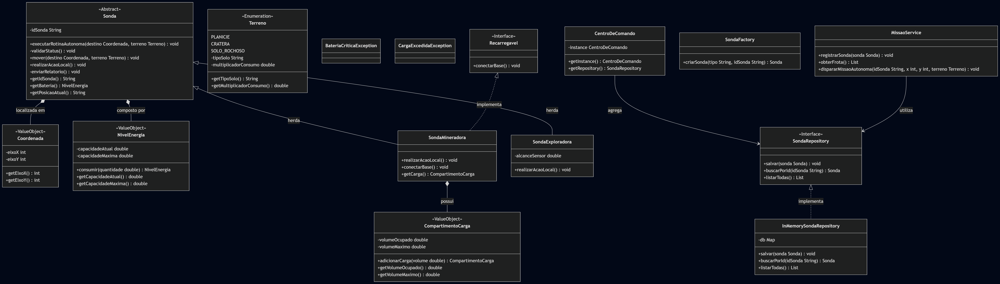

Sistema Autonomo de Frota de Superficie (SAFS) - Industria Espacial
Este projeto consiste em um sistema de gerenciamento e controle de frotas de sondas espaciais autonomas desenvolvido para a Global Solution da FIAP. O ecossistema simula operacoes de exploracao e mineracao espacial (como o Programa Artemis e ISRU) em terrenos hostis com atraso de comunicacao, utilizando conceitos rigidos de Domain-Driven Design (DDD) e padroes de projeto.

Equipe
Nome da Equipe: InovaLink

Integrantes: 

Kauê de Almeida Pena - 564211

Eduardo Delorenzo Moraes - 561749

Lucas Rowlands Abat - 562994

Ronaldo Aparecido Monteiro Almeida - 565017

William Queiroz - 565032 

Arquitetura e Estrutura de Pastas
O codigo foi estruturado seguindo o modelo de arquitetura em camadas para garantir o isolamento total das regras de negocio (Dominio) de detalhes tecnicos (Infraestrutura e Apresentacao). Para evitar problemas de codificacao em diferentes sistemas operacionais e consoles, o codigo nao utiliza acentos.

A organizacao dos pacotes reflete as diretrizes do projeto:

br.com.fiap.space.domain: O coracao do sistema. Contem as Entidades, Value Objects imutaveis, Enums e as Interfaces de repositorio que definem as regras e invariantes de negocio.

br.com.fiap.space.infrastructure: Camada responsavel pela persistencia em memoria e pela criacao estruturada dos objetos do sistema.

br.com.fiap.space.application: Camada que orquestra as acoes e os fluxos de casos de uso do sistema.

br.com.fiap.space.presentation: Camada responsavel pela interface de console interativa com o usuario.

```pastas
src/
└── br/
└── com/
└── fiap/
└── space/
├── domain/
│   ├── Sonda.java
│   ├── SondaMineradora.java
│   ├── SondaExploradora.java
│   ├── Coordenada.java
│   ├── NivelEnergia.java
│   ├── CompartimentoCarga.java
│   ├── Terreno.java
│   ├── Recarregavel.java
│   └── SondaRepository.java
├── infrastructure/
│   ├── InMemorySondaRepository.java
│   ├── CentroDeComando.java
│   └── SondaFactory.java
├── application/
│   └── MissaoService.java
└── presentation/
└── MainConsole.java
```
Recursos e Padroes de Projeto Aplicados
Domain-Driven Design (DDD)
Entities: Sonda e suas subclasses possuem identidade unica representada pelo idSonda. Suas mudancas de estado sao controladas por metodos internos.

Value Objects: Coordenada, NivelEnergia e CompartimentoCarga sao objetos estritamente imutaveis. Qualquer alteracao em seus valores resulta no retorno de uma nova instancia validada, protegendo as regras de negocio contra estados invalidos.

Aggregates e Invariantes: A classe Sonda atua como a raiz do agregado, encapsulando e protegendo a integridade dos niveis de energia e localizacao.

Padroes de Projeto (Design Patterns)
Template Method: Implementado de forma definitiva na classe abstrata Sonda atraves do metodo executarRotinaAutonoma. Ele dita o esqueleto obrigatorio de execucao (validar status, mover, realizar acao local e enviar relatorio).

Polimorfismo (Hook Methods): O metodo realizarAcaoLocal funciona como um gancho customizado nas subclasses. A SondaMineradora executa a perfuracao e incremento de carga, enquanto a SondaExploradora realiza o escaneamento por sensores.

Factory Method: Encapsulado na classe SondaFactory, centralizando a lógica de instanciacao das sondas com base na string do tipo de missao e padronizando o ID para letras maiusculas.

Singleton: Aplicado na classe CentroDeComando para garantir que exista apenas uma instancia do gerenciador de persistencia em memoria rodando durante todo o ciclo de vida do software.

Tratamento de Erros e Validacoes Avançadas
O software conta com barreiras de seguranca em tempo de execucao para prever falhas operacionais e de usabilidade:

Pre-validacao de ID Existente: O menu de comando de missoes checa a existencia da sonda logo no inicio da solicitacao, impedindo que o usuario digite coordenadas e terrenos desnecessariamente caso o ID seja invalido ou inexistente.

Insensibilidade a Caixa (Case Insensitivity): Entradas de texto como tipos de sonda e IDs sao tratados automaticamente com metodos de normalizacao (como .toUpperCase()), aceitando comandos em maiusculo ou minusculo sem quebrar as buscas.

Barreira de Consumo de Energia: O sistema calcula previamente a distancia em metros e o multiplicador do tipo de terreno escolhido (Planicie, Cratera ou Solo Rochoso). Se o consumo calculado exceder a bateria atual, o Value Object bloqueia a acao lancando uma excecao, mantendo a sonda segura na ultima posicao valida.

Como Executar o Projeto
Certifique-se de ter o Java Development Kit (JDK 17 ou superior) instalado no sistema.

Navegue ate a pasta raiz onde os arquivos .java estao localizados estruturalmente.

Compile todas as camadas atraves do terminal:

```bash
javac br/com/fiap/space/presentation/MainConsole.java
```
Execute o programa principal:
````bash
java br.com.fiap.space.presentation.MainConsole
````
Utilize o menu numerico no terminal para criar as sondas, verificar as estatisticas da frota e enviar as coordenadas das rotinas autonomas.

Diagrama:


Vídeo youtube:
https://youtu.be/K-zHbOUG1BU